# Dogfood Report: InternFlow (web + staff)

| Field | Value |
|-------|-------|
| **Date** | 2026-09-24 |
| **App URL** | http://localhost:3000 (web/intern), http://localhost:3001 (staff) |
| **Session** | dogfood-web, dogfood-staff (agent-browser 0.38.1) |
| **Scope** | Full app unauthenticated: root, sign-in, dashboard guard, welcome, activate, reset-password, 404, theme, search, account menu, a11y |

## Summary

| Severity | Count |
|----------|-------|
| Critical | 3 |
| High | 4 |
| Medium | 2 |
| Low | 1 |
| **Total** | **10** |

Note on evidence: `agent-browser record` was unavailable in this environment (`doctor` reports `ffmpeg not found on PATH`), so no `.webm` repro videos. Interactive issues below use step screenshots instead. All findings observed in-browser via snapshot/screenshot/console/network/a11y; no app source was read.

## Issues

### ISSUE-001: Web root `/` hangs forever on “Opening InternFlow…”

| Field | Value |
|-------|-------|
| **Severity** | critical |
| **Category** | functional |
| **URL** | http://localhost:3000/ |
| **Repro Video** | N/A (static on load; ffmpeg missing for video) |

**Description**

Root never boots. Expected: redirect to `/sign-in` when logged out, or `/dashboard` when logged in. Actual: black screen with only `Opening InternFlow…`, zero interactive elements. `snapshot` shows only `main > paragraph > "Opening InternFlow…"`. Waited 25s for `Sign in` text — timed out. Backend `GET http://localhost:4000/health` returns `200 {"status":"ok"}`, and all Vite module requests return 200, console shows only `[vite] connected` + React DevTools info, no JS errors. So the splash is not a backend outage — the index route’s boot/redirect logic never resolves.

**Repro Steps**

1. Navigate to http://localhost:3000/
   

2. Observe snapshot has no interactive elements:
   `snapshot` → `main > paragraph > "Opening InternFlow…"`
3. **Observe:** page never leaves splash; `/sign-in` and `/dashboard` load fine directly, proving only `/` is stuck.

---

### ISSUE-002: Staff root `/` hangs forever on “Opening InternFlow staff…”

| Field | Value |
|-------|-------|
| **Severity** | critical |
| **Category** | functional |
| **URL** | http://localhost:3001/ |
| **Repro Video** | N/A (static on load) |

**Description**

Same as ISSUE-001 on staff app. Expected redirect to `/sign-in`. Actual: `Opening InternFlow staff…` with `(no interactive elements)`. Direct `/sign-in` works, `/` does not. The staff 404 page’s “Back to overview” links to this broken `/`, creating a dead end.

**Repro Steps**

1. Navigate to http://localhost:3001/
   

2. **Observe:** splash never resolves; snapshot empty of interactives.

---

### ISSUE-003: `/activate` and `/reset-password` hang tab to blank `about:blank`

| Field | Value |
|-------|-------|
| **Severity** | critical |
| **Category** | functional |
| **URL** | http://localhost:3000/activate?token=test123, http://localhost:3000/reset-password?token=test123 |
| **Repro Video** | N/A (tab becomes unresponsive; screenshot times out) |

**Description**

Both auth-recovery routes break the tab. Expected: invalid/expired token form with error, or token-entry form. Actual: new tab URL shows the route briefly, then `get url` returns `about:blank`, `snapshot` returns `(empty page)` / `(no interactive elements)`, and `screenshot`/`snapshot` time out after 30s. Had to switch back to a known-good tab (`t6`) to recover. This blocks intern activation and password reset — core lifecycle flows per plan.md.

**Repro Steps**

1. From known-good tab, open http://localhost:3000/activate?token=test123
2. Run `snapshot` → `(empty page)`; `get url` → `about:blank` after hang
3. Repeat with http://localhost:3000/reset-password?token=test123 — same hang, `tab` lists `t10 - http://localhost:3000/reset-password?token=test123` but active content is blank and screenshot times out.
4. **Observe:** tab unresponsive; must abandon it and `tab t6` back to `/nonexistent-xyz` to continue.

---

### ISSUE-004: Unauthenticated `/dashboard` renders full shell + “Unable to load this view” instead of redirect

| Field | Value |
|-------|-------|
| **Severity** | high |
| **Category** | functional / ux |
| **URL** | http://localhost:3000/dashboard (logged out, 0 localStorage keys, `/api/auth/me` → 401) |
| **Repro Video** | N/A (visible on load; step screenshots below) |

**Description**

Expected: logged-out visit redirects to `/sign-in`. Actual: full intern sidebar (Overview, Classes, Upcoming, Past, Assignments, Open, Submitted, Graded, Feedback, Settings), topbar search/theme/account menu, KPI cards all `0`, plus red `Unable to load this view / Your workspace could not load.` with `Try again`. Network confirms `GET /api/intern/dashboard → 401`, `GET /api/auth/me → 401`, `GET /api/intern/assignments → 401` — auth correctly rejects, but router still renders protected UI. Account menu even opens with Profile/Change password/Sign out while logged out.

**Repro Steps**

1. In fresh session (no storage), navigate to http://localhost:3000/dashboard
2. **Observe:** dashboard shell + error banner instead of sign-in redirect.
   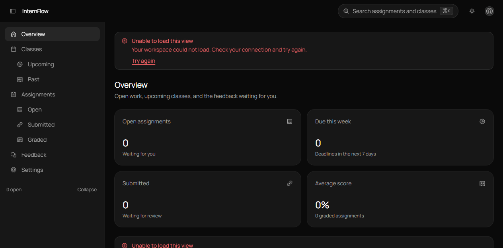

---

### ISSUE-005: Staff `/dashboard` logged-out shows 404 instead of sign-in redirect

| Field | Value |
|-------|-------|
| **Severity** | high |
| **Category** | functional |
| **URL** | http://localhost:3001/dashboard (logged out) |
| **Repro Video** | N/A (static) |

**Description**

Expected: redirect to `http://localhost:3001/sign-in`. Actual: generic `404 / Page not found / The page you are looking for moved, vanished, or never existed.` with `Back to overview` + `Open settings`. Same URL on a bogus path (`/nonexistent-page-xyz`) shows the identical 404, so auth-guard and not-found are indistinguishable. `Back to overview` then lands on broken ISSUE-002 splash.

**Repro Steps**

1. Navigate to http://localhost:3001/dashboard logged out
   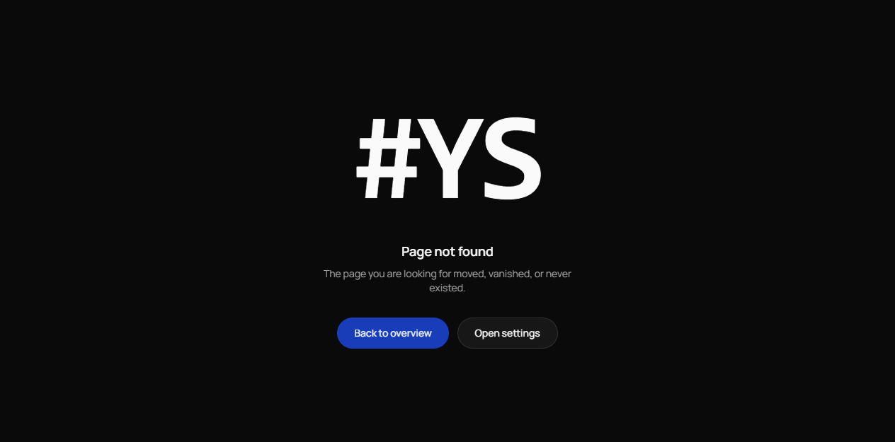
2. Compare with http://localhost:3001/nonexistent-page-xyz
   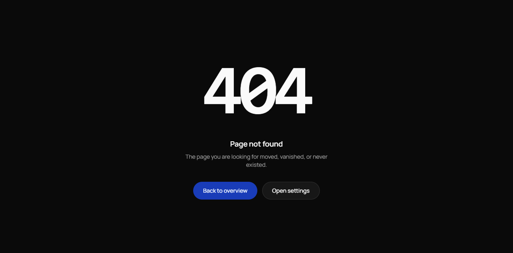
3. **Observe:** identical 404; no redirect to sign-in.

---

### ISSUE-006: `/welcome` renders app shell with blank main content

| Field | Value |
|-------|-------|
| **Severity** | high |
| **Category** | functional / ux |
| **URL** | http://localhost:3000/welcome |
| **Repro Video** | N/A (static) |

**Description**

Expected: marketing/welcome content or redirect. Actual: intern sidebar + topbar render, main panel is empty black. Snapshot is `(empty page)` on first load. No error, no loading indicator, no CTA — a dead-end screen.

**Repro Steps**

1. Navigate to http://localhost:3000/welcome
   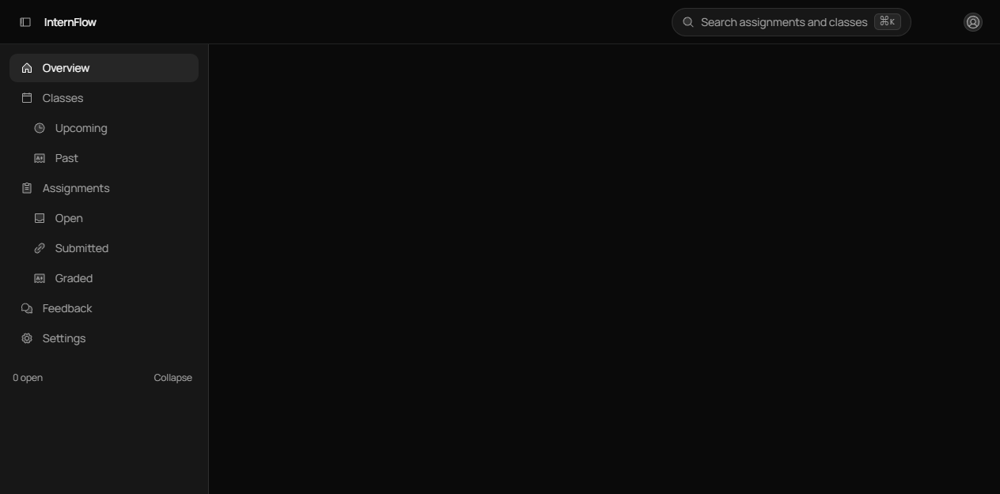
2. **Observe:** sidebar present, content area blank.

---

### ISSUE-007: Light-mode toggle splits page half-black / half-white

| Field | Value |
|-------|-------|
| **Severity** | high |
| **Category** | visual |
| **URL** | http://localhost:3000/sign-in (theme toggle) |
| **Repro Video** | N/A (static visual; video tooling missing) |

**Description**

Expected: full light theme. Actual: after clicking `Switch to light mode`, top half stays black (header/Email field) while bottom half turns white (Password/button). Screenshot shows sharp horizontal split mid-viewport. Toggling back to dark restores uniform dark. Indicates theme background applied to only part of layout (e.g., body vs. container).

**Repro Steps**

1. Navigate to http://localhost:3000/sign-in
2. Click theme toggle `@e2` (`Switch to light mode`)
   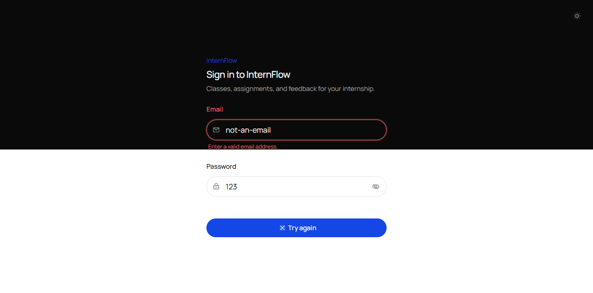
3. **Observe:** split background; Email section dark, Password section white.

---

### ISSUE-008: Sign-in submit button permanently flips to “Try again”

| Field | Value |
|-------|-------|
| **Severity** | medium |
| **Category** | ux |
| **URL** | http://localhost:3000/sign-in, http://localhost:3001/sign-in |
| **Repro Video** | N/A (step screenshots) |

**Description**

Expected: button stays `Sign in` (with `Signing in` spinner during request); errors appear beside fields. Actual: any failed submit — even empty-submit validation — relabels the button to `Try again` with an X icon, and it never reverts even after the user corrects input. Validation messages themselves are correct (`Enter your email.`, `Enter a valid email address.`, `Check the email and password and try again.` for 401), but the persistent `Try again` label implies retry-loop rather than normal sign-in. Reproduces on both web and staff.

**Repro Steps**

1. Navigate to sign-in, click `Sign in` empty:
   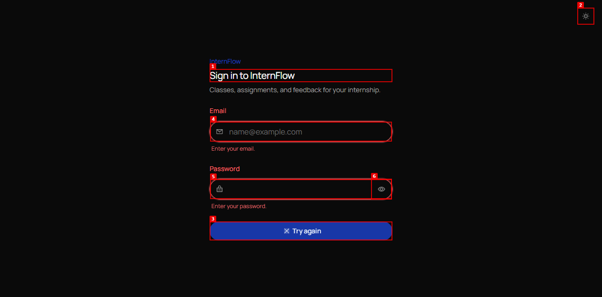 — shows `Enter your email.` + `Enter your password.` but button is now `Try again`.
2. Type `not-an-email` / `123`, submit:
   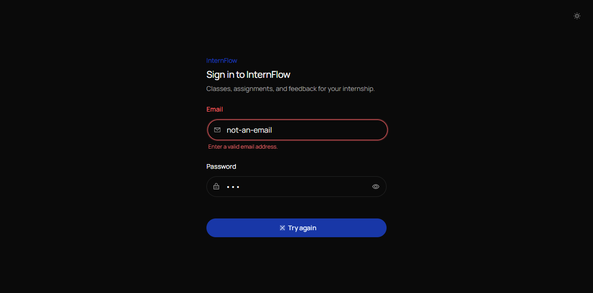 — `Enter a valid email address.`, button still `Try again`.
3. Type valid-shape `test@example.com` / `WrongPassword123!`, submit → `Signing in` → `Check the email and password and try again.`, button `Try again`:
   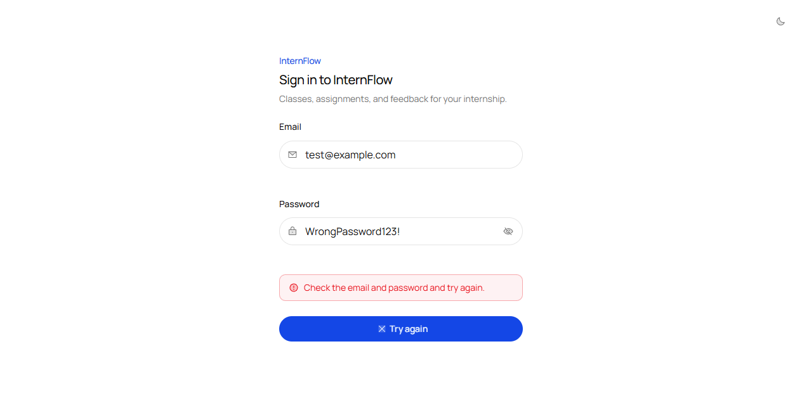
4. Staff same: 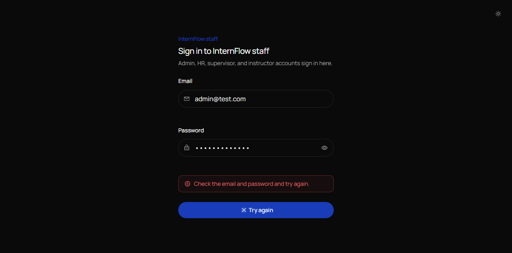
5. **Observe:** label never returns to `Sign in` on edit.

---

### ISSUE-009: URL says `/sign-in` but dashboard shell stays rendered (post sign-out mismatch)

| Field | Value |
|-------|-------|
| **Severity** | medium |
| **Category** | functional |
| **URL** | http://localhost:3000/sign-in (after clicking Sign out while logged out) |
| **Repro Video** | N/A |

**Description**

While unauthenticated on `/dashboard`, opened account menu (which should not offer Profile/Change password/Sign out logged out) and clicked `Sign out`. Toast `Signed out` appeared, `get url` returned `http://localhost:3000/sign-in`, but the viewport still showed the full dashboard (sidebar + Overview + `Unable to load this view`), not the sign-in form. URL and view disagree — layout for `_app` persists across the auth-route transition.

**Repro Steps**

1. On http://localhost:3000/dashboard logged out, click `Open account menu` → `Sign out`.
2. `get url` → `http://localhost:3000/sign-in`, but:
   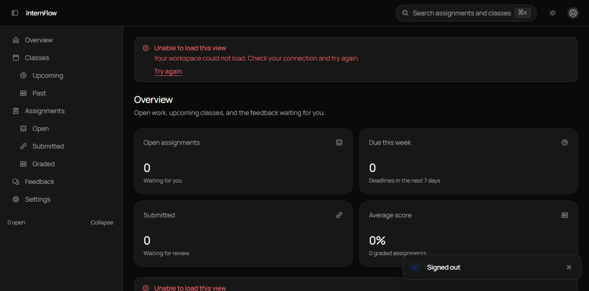 — still dashboard + `Signed out` toast.
3. **Observe:** must hard-navigate to `/sign-in` to see the form.

---

### ISSUE-010: Color-contrast a11y violations (sign-in 1, dashboard 19 nodes)

| Field | Value |
|-------|-------|
| **Severity** | low |
| **Category** | accessibility |
| **URL** | http://localhost:3000/sign-in, http://localhost:3000/dashboard |
| **Repro Video** | N/A |

**Description**

`a11y` (axe-core 4.12.1): sign-in `violations: 1, passes: 34` — `[serious] color-contrast` on `span` in sign-in route; dashboard `violations: 1 (19 nodes), passes: 35` — `[serious] color-contrast` on KPI card text, chart text, page header. No incomplete. Likely muted-foreground on dark cards below ratio. Fix tokens or bump text opacity.

**Repro Steps**

1. `agent-browser --session dogfood-web tab t2` (sign-in) → `a11y` → 1 serious contrast violation.
2. `tab t3` (dashboard) → `a11y` → 1 rule, 19 nodes.
3. **Observe:** repeatable; manual check with axe/contrast meter on KPI/ muted text.

---

## Other observations (not counted as issues)

- 404 pages themselves render correctly with `Back to overview` + secondary link: 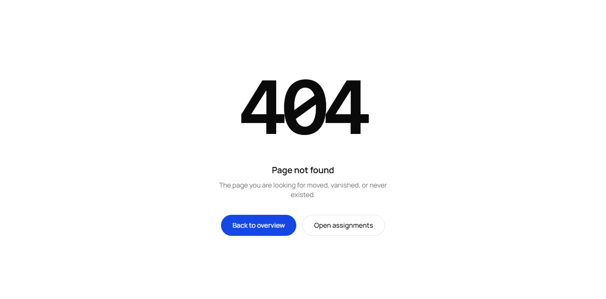. Problem is only that `Back to overview` targets broken `/` (ISSUE-001/002).
- `⌘K` command palette opens and lists nav commands unauthenticated: 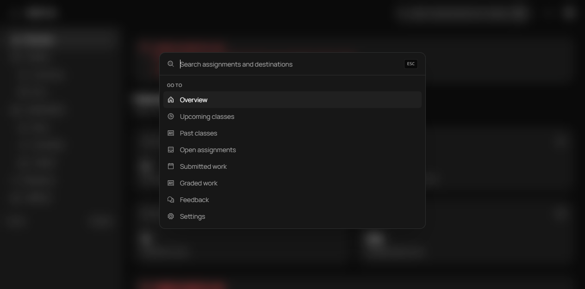. Works, but reinforces ISSUE-004 (nav exposed logged out). Palette overlay also initially blocked topbar clicks with `covered by` until `Escape` closed it — expected modal behavior, not filed.
- `Show/Hide password` toggle works; invalid-email + empty validation messages are clear and sentence-case.
- Wrong-password 401 handling shows proper `Check the email and password and try again.` alert; no stack trace in console.
- No JS exceptions or failed non-auth requests in `console`/`errors` on sign-in, dashboard, 404; only Vite HMR debug + React DevTools info.
- Staff sign-in form renders correctly in dark mode: 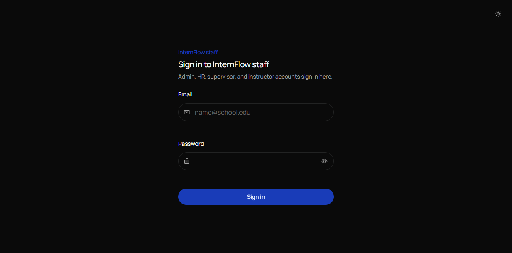.
- Authenticated flows (valid login, classes, assignments, submissions, reviews, AI drafts) were not exercised — no test credentials were provided. Recommend re-run with seeded intern + instructor accounts.

## Environment

- `agent-browser doctor --offline --quick`: 5 pass, 1 warn (`ffmpeg not found on PATH (only needed for record)`), 0 fail. Chrome 153.0.8010.53.
- Backend health during test: `GET http://localhost:4000/health → 200 {"status":"ok"}` via browser `eval` fetch.
- Viewport: 1264x625. Dark mode default.
